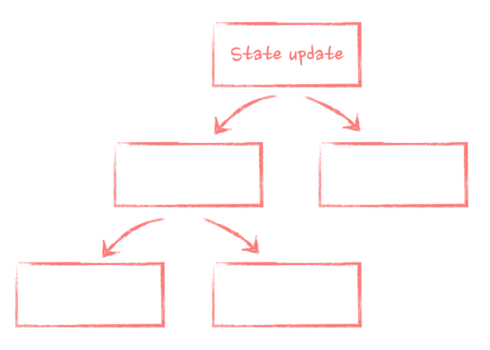
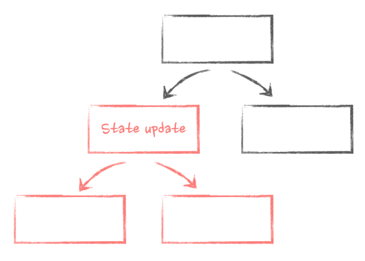
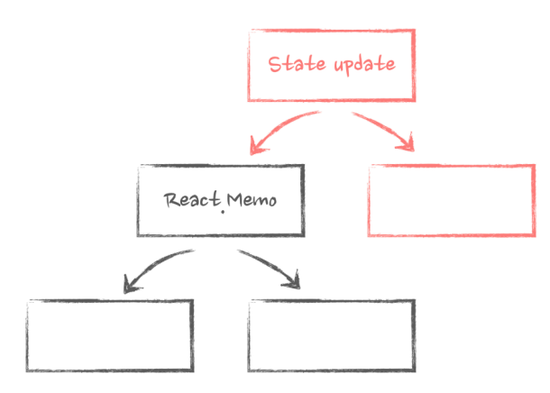
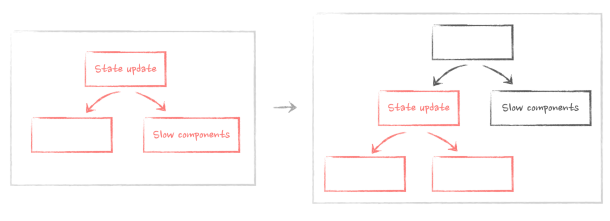

<details>

<summary>Chapter 1. Intro to re-renders</summary>

<br>

<details>

<summary>Goals</summary>

<br>

> Let's dive right in, shall we? And let's talk about performance right away: it's one of the most important topics these days when it comes to building applications, and as a result, it's an overarching theme of this book.

> And when it comes to React and performance in React, it's crucial to understand re-renders and their influence. How they are triggered, how they propagate through the app, what happens when a component re-renders and why, and why we need them in the first place.

> This chapter introduces these concepts, which will be explored in more detail in the next few chapters. And to make it more fun, let's make it in the form of an investigation. Let's introduce a very common performance problem in an app, look at what's happening because of it, and how to fix it with a very simple composition technique. While doing so, you will learn:

- What a re-render is, and why we need it.
- What the initial source of all re-renders is.
- How React propagates re-renders through the app.
- The big re-renders myth and why props changing by themselves
  doesn't matter.
- The "moving state down" technique to improve performance.
- Why hooks can be dangerous when it comes to re-renders.

</details>

<details>

<summary>The problem</summary>

<br>

> Imagine yourself as a developer who inherited a large, complicated, and very performance-sensitive app. Lots of things are happening there, many people have worked on it over the years, millions of customers are using it now. As your first task on the job, you are asked to add a simple button that opens a modal dialog right at the top of this app. You look at the code and find the place where the dialog should be triggered:

```javascript
const App = () => {
  // lots of code here
  return (
    <div className="layout">
      {/* button should go somewhere
here */}
      <VerySlowComponent />
      <BunchOfStuff />
      <OtherStuffAlsoComplicated />
    </div>
  );
};
```

> Then you implement it. The task seems trivial. We've all done it hundreds of times:

```javascript
const App = () => {
  // add some state
  const [isOpen, setIsOpen] = useState(false);
  return (
    <div className="layout">
      {/* add the button */}
      <Button onClick={() => setIsOpen(true)}>Open dialog </Button>
      {/* add the dialog itself */}
      {isOpen ? <ModalDialog onClose={() => setIsOpen(false)} /> : null}
      <VerySlowComponent />
      <BunchOfStuff />
      <OtherStuffAlsoComplicated />
    </div>
  );
};
```

> Just add some state that holds whether the dialog is open or closed. Add the button that triggers the state update on click. And the dialog itself that is rendered if the state variable is true .

> You start the app, try it out - and oops. It takes almost a second to open that simple dialog!

[Interactive example and full code](https://advanced-react.com/examples/01/01)

> People experienced with dealing with React performance might be tempted to say something like: "Ah, of course! You're re-rendering the whole app there, you just need to wrap everything in React.memo and use useCallback hooks to prevent it." And technically this is true. But don't rush. Memoization is completely unnecessary here and will do more harm than good. There is a more efficient way.

> But first, let's review what exactly is happening here and why.

</details>

<details>

<summary>State update, nested components, and re-renders</summary>

<br>
> Let's start from the beginning: the life of our component and the most important stages of it that we need to care about when we talk about performance. Those are: mounting, unmounting, and re-rendering.

> When a component first appears on the screen, we call it mounting. This is when React creates this component's instance for the first time, initializes its state, runs its hooks, and appends elements to the DOM. The end result - we see whatever we render in this component on the screen.

> Then, there is unmounting: this is when React detects that a component is not needed anymore. So it does the final clean-up, destroys this component's instance and everything associated with it, like the component's state, and finally removes the DOM element associated with it.

> And, finally, re-rendering. This is when React updates an already existing component with some new information. Compared to mounting, re-rendering is lightweight: React just re-uses the already existing instance, runs the hooks, does all the necessary calculations, and updates the existing DOM element with the new attributes.

> Every re-render starts with the state. In React, every time we use a hook like useState , useReducer , or any of the external state management libraries like Redux, we add interactivity to a component. From now on, a component will have a piece of data that is preserved throughout its lifecycle. If something happens that needs an interactive response, like a user clicking a button or some external data coming through, we update the state with the new data.

> Re-rendering is one of the most important things to understand in React. This is when React updates the component with the new data and triggers all the hooks that depend on that data. Without these, there will be no data updates in React and, as a result, no interactivity. The app will be completely static. And state update is the initial source of all re-renders in React apps. If we take our initial app as an example:

```javascript
const App = () => {
  const [isOpen, setIsOpen] = useState(false);
  return <Button onClick={() => setIsOpen(true)}>Open dialog </Button>;
};
```

> When we click on the Button , we trigger the setIsOpen setter function: we update the isOpen state with the new value from false to true . As a result, the App component that holds that state re-renders itself.

> After the state is updated and the App component re-renders, the new data needs to be delivered to other components that depend on it. React does this automatically for us: it grabs all the components that the initial component renders inside, re-renders those, then re-renders components nested inside of them, and so on until it reaches the end of the chain of components.

> If you imagine a typical React app as a tree, everything down from where the state update was initiated will be re-rendered.



> In the case of our app, everything that it renders, all those very slow components, will be re-rendered when the state changes:

```javascript
const App = () => {
  const [isOpen, setIsOpen] = useState(false);
  // everything that is returned here will be re-rendered when the state is updated
  return (
    <div className="layout">
      <Button onClick={() => setIsOpen(true)}>Open dialog</Button>
      {isOpen ? <ModalDialog onClose={() => setIsOpen(false)} /> : null}
      <VerySlowComponent />
      <BunchOfStuff />
      <OtherStuffAlsoComplicated />
    </div>
  );
};
```

> As a result, it takes almost a second to open the dialog - React needs to re-render everything before the dialog can appear on the screen.

> The important thing to remember here is that React never goes "up" the render tree when it re-renders components. If a state update originated somewhere in the middle of the components tree, only components "down" the tree will re-render.



> The only way for components at the "bottom" to affect components at the "top" of the hierarchy is for them either to explicitly call state update in the "top" components or to pass components as functions.

</details>

<details>

<summary>The big re-renders myth</summary>

<br>

> Have you noticed that I haven't mentioned anything about props here? You might have heard this statement: "Component re-renders when its props change." It's one of the most common misconceptions in React: everyone believes it, no one doubts it, and it's just not true.

> Normal React behavior is that if a state update is triggered, React will re-render all the nested components regardless of their props. And if a state update is not triggered, then changing props will be just "swallowed": React doesn't monitor them.

> If I have a component with props, and I try to change those props without triggering a state update, something like this:

```javascript
const App = () => {
  // local variable won't work
  let isOpen = false;
  return (
    <div className="layout">
      {/* nothing will happen */}
      <Button onClick={() => (isOpen = true)}>Open dialog </Button>
      {/* will never show up */}
      {isOpen ? <ModalDialog onClose={() => (isOpen = false)} /> : null}
    </div>
  );
};
```

> It just won't work. When the Button is clicked, the local isOpen variable will change. But the React lifecycle is not triggered, so the render output is never updated, and the ModalDialog will never show up.

[Interactive example and full code](https://advanced-react.com/examples/01/02)

> In the context of re-renders, whether props have changed or not on a component matters only in one case: if the said component is wrapped in the React.memo higher-order component. Then, and only then, will React stop its natural chain of re-renders and first check the props. If none of the props change, then re-renders will stop there. If even one single prop changes, they will continue as usual.



> Preventing re-renders with memoization properly is a complicated topic with several caveats. Read about it in more detail in Chapter 5. Memoization with useMemo, useCallback and React.memo.

</details>

<details>

<summary>Moving state down</summary>

> Now that it's clear how React re-renders components, it's time to apply this knowledge to the original problem and fix it. Let's take a closer look at the code, in particular where we use the modal dialog state:

```javascript
const App = () => {
  // our state is declared here
  const [isOpen, setIsOpen] = useState(false);
  return (
    <div className="layout">
      {/* state is used here */}
      <Button onClick={() => setIsOpen(true)}>Open dialog </Button>
      {/* state is used here */}
      {isOpen ? <ModalDialog onClose={() => setIsOpen(false)} /> : null}
      <VerySlowComponent />
      <BunchOfStuff />
      <OtherStuffAlsoComplicated />
    </div>
  );
};
```

> As you can see, it's relatively isolated: we use it only on the Button component and in ModalDialog itself. The rest of the code, all those very slow components, doesn't depend on it and therefore doesn't actually need to re-render when this state changes. It's a classic example of what is called an unnecessary re-render.

> Wrapping them in React.memo will prevent them from re-rendering in this case, this is true. But React.memo has many caveats and complexities around it (see more in Chapter 5. Memoization with useMemo, useCallback and React.memo). There is a better way. All that we need to do is to extract components that depend on that state and the state itself into a smaller component:

```javascript
const ButtonWithModalDialog = () => {
  const [isOpen, setIsOpen] = useState(false);
  // render only Button and ModalDialog here
  return (
    <>
      <Button onClick={() => setIsOpen(true)}>
        Open dialog
      </Button>
      {isOpen ? (
        <ModalDialog onClose={() => setIsOpen(false)} />
      ) : null}
    </>
  );
};

<>
  <Button onClick={() => setIsOpen(true)}>
    Open dialog
  </Button>
  {isOpen ? (
    <ModalDialog onClose={() => setIsOpen(false)} />
  ) : null}
</>
);
};

```

> And then just render this new component in the original big App :

```javascript
const App = () => {
  return (
    <div className="layout">
      {/* here it goes, component
with the state inside */}
      <ButtonWithModalDialog />
      <VerySlowComponent />
      <BunchOfStuff />
      <OtherStuffAlsoComplicated />
    </div>
  );
};
```

[Interactive example and full code](https://advanced-react.com/examples/01/03)

> Now, the state update when the Button is clicked is still triggered, and some components re-render because of it. But! It only happens with components inside the ButtonWithModalDialog component. And it's just a tiny button and the dialog that should be rendered anyway. The rest of the app is safe.

> Essentially, we just created a new sub-branch inside our render tree and moved our state down to it.



> As a result, the modal dialog appears instantly. We just fixed a big performance problem with a simple composition technique!

</details>

<details>
<summary>The danger of custom hooks
</summary>
<br>

> Another very important concept that we should not forget when dealing with state, re-renders, and performance is custom hooks. After all, they were introduced exactly so that we could abstract away stateful logic. It's very common to see logic like the one we had above extracted into something like the useModalDialog hook. A simplified version could look like this:

```javascript
const useModalDialog = () => {
  const [isOpen, setIsOpen] = useState(false);
  return {
    isOpen,
    open: () => setIsOpen(true),
    close: () => setIsOpen(false),
  };
};
```

> And then use this hook in our App instead of setting state directly:

```javascript
const App = () => {
  // state is in the hook now
  const { isOpen, open, close } = useModalDialog();
  return (
    <div className="layout">
      {/* just use "open" method
from the hook */}
      <Button onClick={open}>Open dialog</Button>
      {/* just use "close" method
from the hook */}
      {isOpen ? <ModalDialog onClose={close} /> : null}
      <VerySlowComponent />
      <BunchOfStuff />
      <OtherStuffAlsoComplicated />
    </div>
  );
};
```

> Why did I call this "the danger"? It seems like a reasonable pattern, and the code is slightly cleaner. Because the hook hides the fact that we have state in the app. But the state is still there! Every time it changes, it will still trigger a re-render of the component that uses this hook. It doesn't even matter whether this state is used in the App directly or even whether the hook returns anything.

[Interactive example and full code](https://advanced-react.com/examples/01/04)

> If, for example, I want to be fancy with this dialog's positioning and introduce some state inside that hook that listens for the window's resize:

```javascript
const useModalDialog = () => {
  const [width, setWidth] = useState(0);
  useEffect(() => {
    const listener = () => {
      setWidth(window.innerWidth);
    };
    window.addEventListener('resize', listener);
    return () =>
      window.removeEventListener('resize', listener);
  }, []);
  // return is the same
  return ...
}

```

[Interactive example and full code](https://advanced-react.com/examples/01/05)

> Hooks are essentially just pockets in your trousers. If, instead of carrying a 10-kilogram dumbbell in your hands, you put it in your pocket, it wouldn't change the fact that it's still hard to run: you have 10 kilograms of additional weight on your person. But if you put that ten kilograms in a self-driving trolley, you can run around freely and fresh and maybe even stop for coffee: the trolley will take care of itself. Components for the state are that trolley.

> Exactly the same logic applies to the hooks that use other hooks: anything that can trigger a re-render, however deep in the chain of hooks it's happening, will trigger a re-render in the component that uses that very first hook. If I extract that additional state into a hook that returns null , App will still re-render on every resize:

```javascript
const useResizeDetector = () => {
  const [width, setWidth] = useState(0);
  useEffect(() => {
    const listener = () => {
      setWidth(window.innerWidth);
    };
    window.addEventListener('resize', listener);
    return () => window.removeEventListener('resize', listener);
  }, []);
  return null;
}
const useModalDialog = () => {
  // I don't even use it, just
  call it here
  useResizeDetector();
  // return is the same
  return {
    isOpen,
    open,
    close,
  };
}
const useModalDialog = () => {
// I don't even use it, just
call it here
useResizeDetector();
// return is the same
return {
  isOpen,
  open,
  close,
};
}
const App = () => {
// this hook uses
useResizeDetector underneath
that triggers state update on
resize
// the entire App will re-render on every resize!
const { isOpen, open, close }
= useModalDialog();
return // same return
}
```

[Interactive example and full code](https://advanced-react.com/examples/01/06)

</details>

</details>

<details>
<summary></summary>
<br>
</details>

<details>
<summary></summary>
<br>
</details>

<details>
<summary></summary>
<br>
</details>

<details>
<summary></summary>
<br>
</details>
