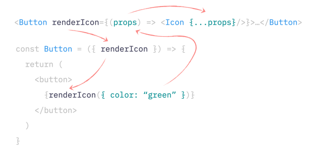

# Render props for rendering Elements

> Luckily, as I mentioned before, there are one million ways to solve exactly the same problem in React. In this case, instead of passing elements as a prop, we can pass them as a render prop (or render function). A render prop is nothing more than just a function that returns an Element. That function is almost the same as a Component. Only a Component you wouldn't call directly - React does it for you. But a render function is under your command.

> In the case of the Button and its icon, here is how it would look like with the render function:

```javascript
// instead of "icon" that expects an Element
// we're receiving a function that returns an Element
const Button = ({ renderIcon }) => {
  // and then just calling this function where the icon should be rendered
  return <button>Submit {renderIcon()}</button>;
};
```

> We accept a renderIcon function and just call it where the icon is supposed to go. And then, on the consumer side, we'd pass the function that returns the icon instead of passing the icon directly:

```Javascript
<Button
    renderIcon={() => <HomeIcon />}
/>
```

> And we can still adjust that icon to our needs, of course, same as the regular Element:

```Javascript
// red icon
<Button
    renderIcon={() => (
        <HomeIcon color="red" />
    )}
/>

// large icon
<Button
    renderIcon={() => (
        <HomeIcon size="large" />
    )}
/>
```

> So, what's the point of using this function? First of all, icons' props. Now, instead of cloning elements, which is a bit of a shady move anyway, we can just pass the object to the function:

```Javascript
const Button = ({ appearance, size, renderIcon }) => {
    // create default props as before
    const defaultIconProps = {
        size: size === 'large' ? 'large' : 'medium',
        color: appearance === 'primary' ? 'white' : 'black'
    };

    // and just pass them to the function
    return (
        <button>
            Submit {renderIcon(defaultIconProps)}
        </button>
    );
};
```

> And then, on the icon's side, we can accept them and spread them over the icon:

```Javascript
<Button
    renderIcon={(props) => <HomeIcon {...props} />}
/>

// We can override some of them:
<Button
    renderIcon={(props) => (
        <HomeIcon
            {...props}
            size="large"
            color="red"
        />
    )}
/>
```

> Or convert them to the props our icon actually accepts:

```Javascript
<Button
    renderIcon={(props) => (
        <HomeIcon
            fontSize={props.size}
            style={{ color: props.color }}
        />
    )}
/>
```

[Interactive example and full code](https://advanced-react.com/examples/04/01)

> Everything is explicit, and nothing overrides anything by some hidden magic. The flow of data, although a bit loopy, is visible and traceable.



> Sharing state is also not a problem anymore. We can simply merge that state value into the object we're passing to the icon:

```javascript
const Button = ({ appearance, size, renderIcon }) => {
    const [isHovered, setIsHovered] = useState(false);

    const iconParams = {
        size: size === 'large' ? 'large' : 'medium',
        color: appearance === 'primary' ? 'white' : 'black',
        // add state here - it's just an object after all
        isHovered,
    };

    return (
        <button ...>
            Submit {renderIcon(iconParams)}
        </button>
    );
};
```

> Or we can even go fancy and pass it as a second argument to clearly separate state and props. Whatever makes sense for our codebase:

```Javascript
const Button = ({ appearance, size, renderIcon }) => {
    const [isHovered, setIsHovered] = useState(false);

    const iconParams = {
        size: size === 'large' ? 'large' : 'medium',
        color: appearance === 'primary' ? 'white' : 'black',
    }

    // pass state here as a second argument
    return (
        <button ...>
            Submit {renderIcon(iconParams, { isHovered })}
        </button>
    );
}
```

> And then on the icon side, we can again do whatever we want with that hovered state. We can render another icon:

```Javascript
const icon = (props, state) =>
    state.isHovered ? (
        <HomeIconHovered {...props} />
    ) : (
        <HomeIcon {...props} />
    );

<Button renderIcon={icon} />
```

> Apply a different className:

```Javascript
const icon = (props, state) => (
    <HomeIcon
        {...props}
        className={state.isHovered ? 'hovered' : ''}
    />
);

<Button renderIcon={icon} />
```

> Or just ignore it completely.

[Interactive example and full code](https://advanced-react.com/examples/04/02)

⬅️ **Back:📑 [Table of Contents](../../Readme.md)**

➡️ **Next Chapter: 🤝 [Sharing stateful logic: children as render props](./04-Sharing-Stateful-Logic-Children-As-Render-Props.md)**
