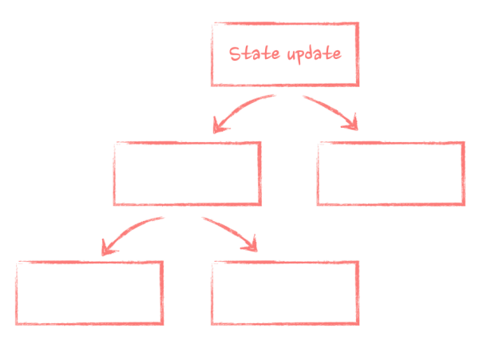
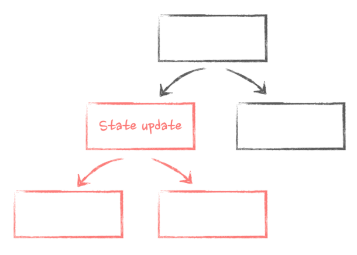

# State update, nested components, and re-renders

> Let's start from the beginning: the life of our component and the most important stages of it that we need to care about when we talk about performance. Those are: mounting, unmounting, and re-rendering.
> When a component first appears on the screen, we call it mounting. This is when React creates this component's instance for the first time, initializes its state, runs its hooks, and appends elements to the DOM. The end result - we see whatever we render in this component on the screen.
> Then, there is unmounting: this is when React detects that a component is not needed anymore. So it does the final clean-up, destroys this component's instance and everything associated with it, like the component's state, and finally removes the DOM element associated with it.
> And, finally, re-rendering. This is when React updates an already existing component with some new information. Compared to mounting, re-rendering is lightweight: React just re-uses the already existing instance, runs the hooks, does all the necessary calculations, and updates the existing DOM element with the new attributes.
> Every re-render starts with the state. In React, every time we use a hook like useState , useReducer , or any of the external state management libraries like Redux, we add interactivity to a component. From now on, a component will have a piece of data that is preserved throughout its lifecycle. If something happens that needs an interactive response, like a user clicking a button or some external data coming through, we update the state with the new data.
> Re-rendering is one of the most important things to understand in React. This is when React updates the component with the new data and triggers all the hooks that depend on that data. Without these, there will be no data updates in React and, as a result, no interactivity. The app will be completely static. And state update is the initial source of all re-renders in React apps. If we take our initial app as an example:

```javascript
const App = () => {
  const [isOpen, setIsOpen] = useState(false);
  return <Button onClick={() => setIsOpen(true)}>Open dialog </Button>;
};
```

> When we click on the Button , we trigger the setIsOpen setter function: we update the isOpen state with the new value from false to true . As a result, the App component that holds that state re-renders itself.
> After the state is updated and the App component re-renders, the new data needs to be delivered to other components that depend on it. React does this automatically for us: it grabs all the components that the initial component renders inside, re-renders those, then re-renders components nested inside of them, and so on until it reaches the end of the chain of components.
> If you imagine a typical React app as a tree, everything down from where the state update was initiated will be re-rendered.



> In the case of our app, everything that it renders, all those very slow components, will be re-rendered when the state changes:

```javascript
const App = () => {
  const [isOpen, setIsOpen] = useState(false);
  // everything that is returned here will be re-rendered when the state is updated
  return (
    <div className="layout">
      <Button onClick={() => setIsOpen(true)}>Open dialog</Button>
      {isOpen ? <ModalDialog onClose={() => setIsOpen(false)} /> : null}
      <VerySlowComponent />
      <BunchOfStuff />
      <OtherStuffAlsoComplicated />
    </div>
  );
};
```

> As a result, it takes almost a second to open the dialog - React needs to re-render everything before the dialog can appear on the screen.
> The important thing to remember here is that React never goes "up" the render tree when it re-renders components. If a state update originated somewhere in the middle of the components tree, only components "down" the tree will re-render.



> The only way for components at the "bottom" to affect components at the "top" of the hierarchy is for them either to explicitly call state update in the "top" components or to pass components as functions.

⬅️ **Back:📑 [Table of Contents](../Readme.md)**
</br>
➡️ **Next Chapter: 🎭 [The big re-renders myth](./04-The-Big-Re-Renders-Myth.md)**
