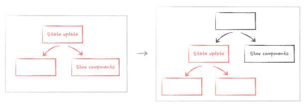

# Moving state down

> Now that it's clear how React re-renders components, it's time to apply this knowledge to the original problem and fix it. Let's take a closer look at the code, in particular where we use the modal dialog state:

```javascript
const App = () => {
  // our state is declared here
  const [isOpen, setIsOpen] = useState(false);
  return (
    <div className="layout">
      {/* state is used here */}
      <Button onClick={() => setIsOpen(true)}>Open dialog </Button>
      {/* state is used here */}
      {isOpen ? <ModalDialog onClose={() => setIsOpen(false)} /> : null}
      <VerySlowComponent />
      <BunchOfStuff />
      <OtherStuffAlsoComplicated />
    </div>
  );
};
```

> As you can see, it's relatively isolated: we use it only on the Button component and in ModalDialog itself. The rest of the code, all those very slow components, doesn't depend on it and therefore doesn't actually need to re-render when this state changes. It's a classic example of what is called an unnecessary re-render.
> Wrapping them in React.memo will prevent them from re-rendering in this case, this is true. But React.memo has many caveats and complexities around it (see more in Chapter 5. Memoization with useMemo, useCallback and React.memo). There is a better way. All that we need to do is to extract components that depend on that state and the state itself into a smaller component:

```javascript
const ButtonWithModalDialog = () => {
  const [isOpen, setIsOpen] = useState(false);
  // render only Button and ModalDialog here
  return (
    <>
      <Button onClick={() => setIsOpen(true)}>Open dialog</Button>
      {isOpen ? <ModalDialog onClose={() => setIsOpen(false)} /> : null}
    </>
  );
};
```

> And then just render this new component in the original big App :

```javascript
const App = () => {
  return (
    <div className="layout">
      {/* here it goes, component
with the state inside */}
      <ButtonWithModalDialog />
      <VerySlowComponent />
      <BunchOfStuff />
      <OtherStuffAlsoComplicated />
    </div>
  );
};
```

[Interactive example and full code](https://advanced-react.com/examples/01/03)

> Now, the state update when the Button is clicked is still triggered, and some components re-render because of it. But! It only happens with components inside the ButtonWithModalDialog component. And it's just a tiny button and the dialog that should be rendered anyway. The rest of the app is safe.
> Essentially, we just created a new sub-branch inside our render tree and moved our state down to it.



> As a result, the modal dialog appears instantly. We just fixed a big performance problem with a simple composition technique!

⬅️ **Back:📑 [Table of Contents](../Readme.md)**

➡️ **Next Chapter: 🎯 [Key takeaways](./07-Key-Takeaways.md)**
